# .NET on AWS Open Source Software Fund ([FOSS](https://github.com/indeedeng/FOSS-Contributor-Fund) fund)

The .NET on AWS team is committed to supporting a healthy and thriving .NET OSS ecosystem. We understand that .NET Open Source is a labor of love for a lot of project maintainers and we want to show our appreciation to projects that are vital to the ecosystem.

### What is the fund?

For 2023, we are growing the size of the program, continuing on the work done in 2022 when 10 projects were selected and given a one-time donation of $5,000. In 2023, we will have an expanded process for selecting projects, as well as increasing the number of projects sponsored and the funding amount, moving to 12 total projects, one per month, with a per project funding of $6,000.

Every month a new fund will be initiated, with a selection process that is unique every month. Instead of a one-time donation, the selected project will receive 12 monthly donations, via GitHub sponsors, in the amount of $500, totalling $6,000.

### How projects get selected?

Every month, the selection committee nominates 2-3 projects to put up for selection. There are some criteria for projects to be eligible.

- The project has an [OSI-approved open source license](https://opensource.org/)
- Must have [GitHub Sponsors](https://github.com/sponsors) enabled for the organization/primary user of the project
- Project is making a decision to actively prioritize diversity, equity, inclusion and accessibility.

Once all nominations are complete, the selection committee will vote, via [ranked-choice voting](https://en.wikipedia.org/wiki/Ranked_voting), to select a project to award the grant to. The news of this award will be made to the maintainer and if the recipient chooses to receive the award, the donation will be initiated via GitHub sponsors. If the recipient declines the award, the 2nd place vote getter will be notified and so on. Once initial funding has been completed, the selected project will be announced here as well as amplified on the [@dotnetOnAWS Twitter Handle](https://twitter.com/dotnetonaws)

## 2023 Selection Committee
<table>
    <tr>
        <td style="text-align: center; vertical-align: middle;">
            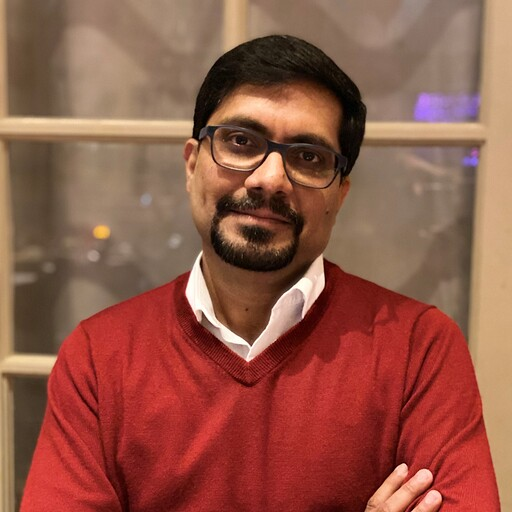
             
            <a href="https://www.linkedin.com/in/abhiramgujjewar/" target="_blank">Abhi Gujjewar</a>
        </td>
        <td style="text-align: center; vertical-align: middle;">
            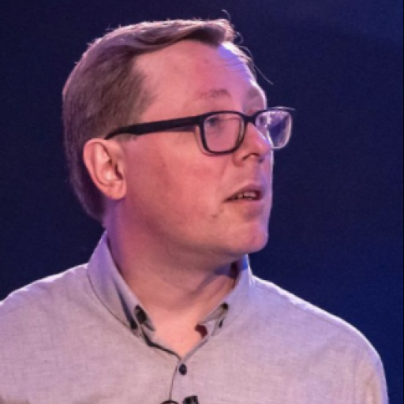
             
            <a href="https://twitter.com/Zimareff" target="_blank">Alexey Zimarev</a>
        </td>
        <td style="text-align: center; vertical-align: middle;">
            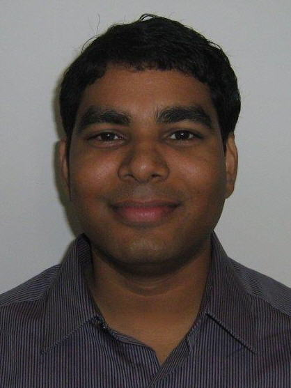
             
            <a href="https://www.linkedin.com/in/biroj/" target="_blank">Biroj Nayak</a>
        </td style="text-align: center; vertical-align: middle;">
        <td>
            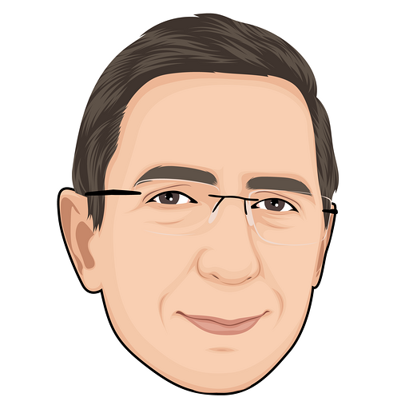
             
            <a href="https://twitter.com/bryanjhogan" target="_blank">Bryan Hogan</a>
        </td>
    </tr>
    <tr>
        <td style="text-align: center; vertical-align: middle;">
            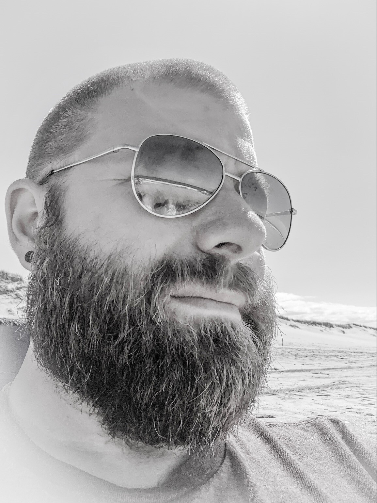
             
            <a href="https://www.linkedin.com/in/daveaglick/" target="_blank">Dave Glick</a>
        </td>
        <td style="text-align: center; vertical-align: middle;">
            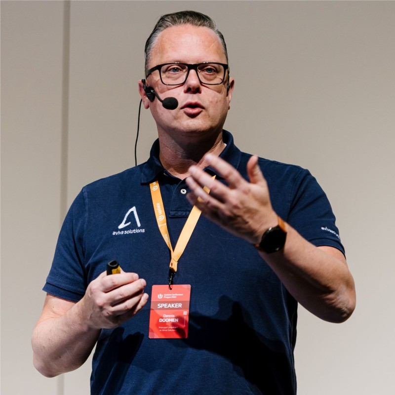
             
            <a href="https://twitter.com/ddoomen" target="_blank">Dennis Doomen</a>
        </td>
        <td style="text-align: center; vertical-align: middle;">
            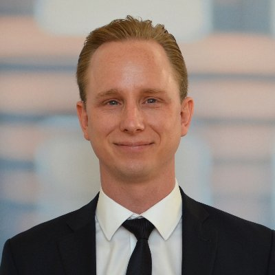
             
            <a href="https://twitter.com/egilhansen" target="_blank">Egil Hansen</a>
        </td>
        <td style="text-align: center; vertical-align: middle;">
            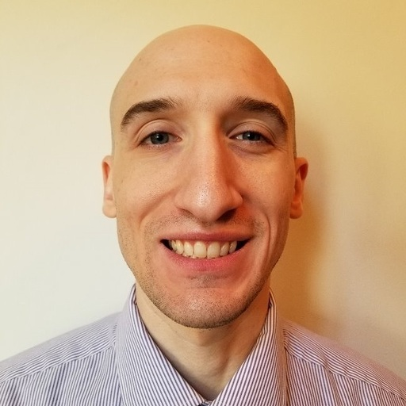
             
            <a href="https://twitter.com/isaacrlevin" target="_blank">Isaac Levin</a>
        </td>
    </tr>
    <tr>
        <td style="text-align: center; vertical-align: middle;">
            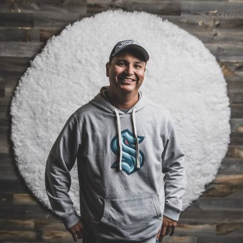
             
            <a href="https://twitter.com/jglozano" target="_blank">Javier Lozano</a>
        </td>
        <td style="text-align: center; vertical-align: middle;">
            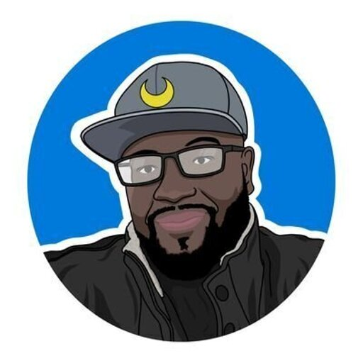
             
            <a href="https://twitter.com/sinclairinat0r" target="_blank">Jeremy Sinclair</a>
        </td>
        <td style="text-align: center; vertical-align: middle;">
            
             
            <a href="https://twitter.com/jguadagno" target="_blank">Joe Guadagno</a>
        </td>
        <td style="text-align: center; vertical-align: middle;">
            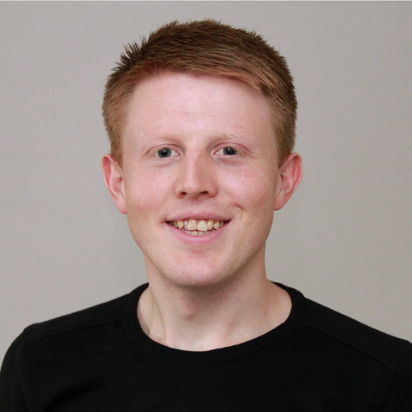
             
            <a href="https://twitter.com/jnyrup" target="_blank">Jonas Nyrup</a>
        </td>
    </tr>
    <tr>
        <td style="text-align: center; vertical-align: middle;">
            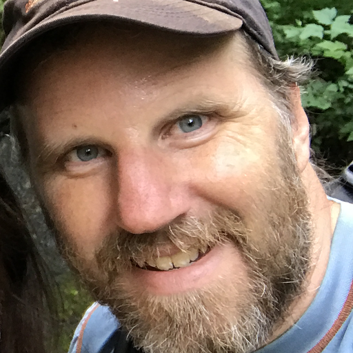
             
            <a href="https://twitter.com/socketnorm" target="_blank">Norm Johanson</a>
        </td>
        <td style="text-align: center; vertical-align: middle;">
            
             
            <a href="https://www.linkedin.com/in/philip-p-9796183/" target="_blank">PJ Pittle</a>
        </td>
        <td style="text-align: center; vertical-align: middle;">
            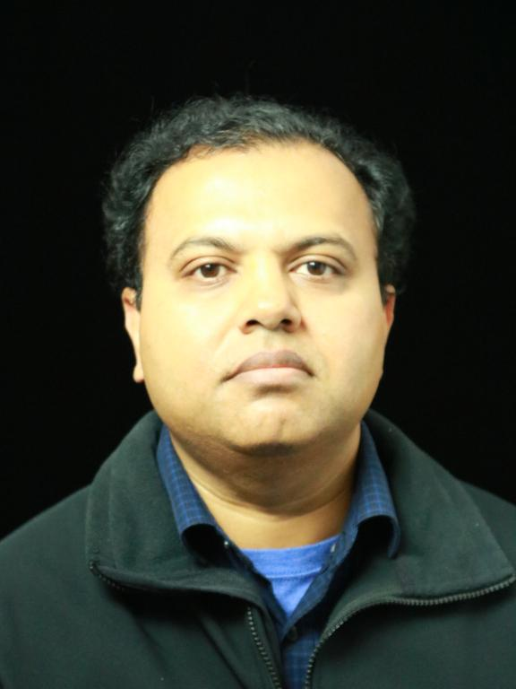
             
            <a href="https://www.linkedin.com/in/samiullah-mohammed-6948842/" target="_blank">Samiullah Mohammed</a>
        </td>
        <td></td>
    </tr>
</table>

## Funding Recipients

### 2023

| Month | Project  |
| -------- | --------------- |
| January  | [AngleSharp](https://github.com/AngleSharp/AngleSharp) |
| February | [MassTransit](https://github.com/MassTransit/MassTransit) |
| March    | |
| April    | |
| May      |  |
| June     |
| July     |
| August     |
| September   |
| October|
| November  |
| December  |

### 2022

In 2022, the .NET on AWS team sponsored 10 projects with one-time donations of $5,000 for their contributions to the .NET Open Source Ecosystem.

| Project |
| --------------- |
| [AutoMapper](https://github.com/AutoMapper/AutoMapper) |
| [Moq](https://github.com/Moq/moq) |
| [FluentValidation](https://github.com/FluentValidation/FluentValidation) |
| [FluentAssertions](https://github.com/fluentassertions/fluentassertions) |
| [Autofac](https://github.com/autofac/Autofac) |
| [Buildalyzer](https://github.com/daveaglick/Buildalyzer) |
| [SixLabors.ImageSharp](https://github.com/SixLabors/ImageSharp) |
| [Swashbuckle](https://github.com/domaindrivendev/Swashbuckle.AspNetCore) |
| [RestSharp](https://github.com/restsharp/RestSharp) |
| [bUnit](https://github.com/bUnit-dev/bUnit) |

## Other FOSS Funds

The .NET on AWS team is not alone in funding to Open Source via a FOSS Fund model. The model was initially created by the open source engineering group at Indeed, and has been iterated by countless other companies. If you are interested in learning more about their approach, you can read the blog post [The FOSS Contributor Fund: Six Months In](https://engineering.indeedblog.com/blog/2019/07/foss-fund-six-months-in/).

## Resources

To learn more about the work the .NET on AWS team, and AWS in general is doing, here are some links to learn more about our efforts

- [.NET on AWS](http://aws.amazon.com/dotnet)
- [AWS Open Source](https://aws.amazon.com/opensource)
- [.NET on AWS GitHub](https://github.com/aws/dotnet)
